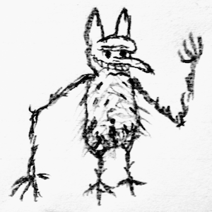
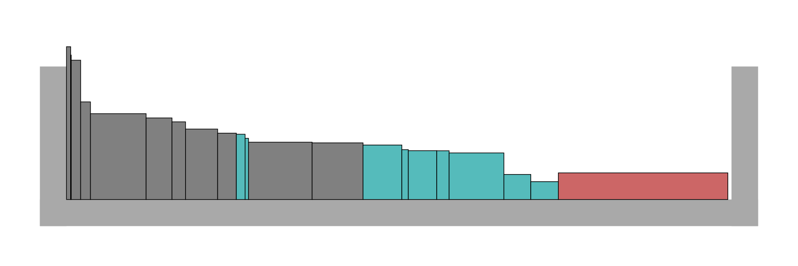

# Performance Goblin
(by [Evan Balster](https://imitone.com))

A little goblin who gleefully adjusts quality settings to maximize our gaming experience.




## The Goblin Algorithm

>  `goblin.h`  `class Goblin_<T_Economy>` depends on `knapsack.h ` `profile.h` `economy.h`

The goblin solves a problem formulated as follows:

* We have a list of **settings** to manage, which may change at random.
* Each setting has a fixed list of **options**; we select one option for each setting each frame.
* Each option has a real **value**, which may change over time.
  * The algorithm tries to maximize **total value** of selected options each frame.
* Each option has an unknown cost (usually time), called its **burden**.
  * The algorithm tries to keep **total burden** under a **capacity** each frame.
  * Settings provide **measurements** of burden for previously selected options.

The Goblin experiments with the available settings until it learns to predict the burden of every available option.  With some practice it can effectively maximize 

#### Settings

This library uses an abstract class `Setting_<T_Economy>`, with the following virtual methods:

* `options` : provide a list of options, each defining its **value**.
* `choice_default` : indicate the default option.
* `choice_set` : set an option for the next frame.  Called by the Goblin algorithm.
* `id` : identifier for the **Performance Profile**.
* `measurement` : get option/burden information from previous frame(s).

Settings may be `add`-ed or `remove`-d from the Goblin at any time.

#### Subroutines

The goblin solves this problem in three steps.

1. Accumulate **measurements** into a **Performance Profile**.
2. Design a **Modified Approximate Knapsack Problem** based on the performance profile.
3. Use the **Knapsack Algorithm** to make a choice for each setting.

See the Implementation section below for more information on these steps.


## Utility Setting Implementations

`goblin_settings.h`

This header provides simple Setting implementations for common uses.  These may be extended or used directly.

##### Binary

Simple on/off settings are common and may be modeled with this template.

```c++
template<typename T_Econ> using Setting_Binary_ = Setting_Array_<T_Econ, 2>;

Setting_Binary_<T_Economy> *Create_Setting_OnOff_<T_Economy, N>(
	string   id,
	value_t  value_on,
	value_t  value_off      = 0,
 	uint16_t default_choice = 0);
```

In the example Knapsack Algorithm image, blue boxes represents binary burdens.

##### Array

Use this template to model multiple-choice settings with a static list of options.

```c++
class Setting_Array_<T_Economy, T_Option_Count> {...}

Setting_Array_<T_Economy, N> *Create_Setting_<T_Economy, N>(
	string   id,
	Option   options[N],
	uint16_t default_choice = 0)
```

The algorithm supports an arbitrary number of options per decision.  These may have arbitrary burdens and values — but it is advisable to avoid extreme ranges of value, as these may dominate other decisions.

In the example Knapsack Algorithm image, grey boxes represent multiple-choice burdens.

##### Fixed Burdens

Burdens the Goblin has no control over may be modeled as single-option settings.

```c++
template<typename T_Econ> using Setting_Fixed_ = Setting_Array_<T_Econ, 1>;

Setting_Binary_<T_Economy> *Create_Setting_Fixed_<T_Economy, N>(
	string  id,
	value_t value = 0);
```

In most cases, our settings will only control part of the overall burden, and some of the workload we're budgeting for is non-negotiable.  We can model this as a decision with only one option, having no value.

Where possible, it may be advantageous to measure individual non-controllable burdens so that the Goblin can quickly adapt when these appear and disappear.  Otherwise, we rely on the "recent" statistic catching up with any sudden increases in cost.

In the example Knapsack Algorithm image, the red box represents a miscellaneous burden that is not associated with any setting.

##### Fixed Incentives

We can affect the final net value of any solution by adding a fixed item with non-zero value (potentially with zero burden).  This will never affect the choices made by the Goblin (or Knapsack) algorithm, but may be useful for implementing **strategies** (see below).


## Performance Profiles

>  `profile.h` `class Profile_<T_Economy>` depends on `economy.h`

The Goblin algorithm creates a Performance Profile as it collect measurements.

Performance profiles are a collection of **Task** entries keyed by an **identifier**, which may be re-used for settings with identical burdens.

Each Task contains a list of **Estimates** (one per option).  Each Estimate calculates normal distributions estimating the burden of the associated option: one for the `full` run, and one for `recent` frames.

#### Saving and Restoring

`profile_json.h` allows profile information describing the (`full`) run to be saved to and restored from a constrained JSON representation of the following format:

```json
{
	"identifier" : [[123, 123.45, 67.89], [123, 123.45, 67.89], <...>],
	<...>
}
```

The Goblin's `set_past_profile` method may be used to achieve immediate high performance in future runs.  Past profiles are assumed subject to an unknown scaling factor (such as CPU speed), allowing profiles to be re-used on different machines.

#### A Note on Consistency

The current library implementation may malfunction if the number of options associated with a setting or setting-ID changes from run to run.  `<cassert>` directives are in place to detect this type of error while debugging.


## The Knapsack Algorithm

>  `knapsack.h`  `class Knapsack_<T_Economy>` depends on `economy.h`

This library is based on a single-header algorithm for "Multiple-Choice Knapsack Problems" of the following form:

- We have a list of **decisions** to make.
- Each decision has a list of **options**, from which we choose exactly one.
- Each option defines a **burden** and a **value**.
  - We have a **capacity** that limits the **total burden** of chosen options.
  - We want to maximize **total value**.

Intuitively, we have a box of limited size, and we're trying to fit as much as possible.  Here's an example solution, where the width of a box represents burden and the area of the box represents value.  Note the small amount of unused space:



Finding the highest-value choices is NP-hard, so this algorithm has a **precision** parameter.  The default precision of 20 allows for a solution whose value is up to 5% (1/20) lower than the best possible solution.

This algorithm runs in **O(N² × M × precision) **time, where N is the number of decisions and M is the mean number of options per decision.

The algorithm works by rounding each choice's value to an integer "score" between 0 and precision.  It then examines every set `0..i` up to `i = N`.  For each subset, it find the lowest-burden strategy for every possible total score and enters these into a table of size **N × max_score** (where the latter is the highest net score possible).  Each row in the table is based on the previous row.  Finally, we look at the complete set `0..N` and find the highest value for which the minimum burden does not exceed our capacity.

This algorithm is based on a commonly-used FPTAS algorithm for the traditional knapsack problem, with two generalizations:

**Multiple Choice**.  Each item in the knapsack is chosen from a set of several alternatives.

**Normally-Distributed Weights**.  The Goblin uses `Economy_Normal` to formulate a knapsack problem in terms of normally-distributed weights.  In order to achieve a low probability of going over-capacity, the solution must satisfy this inequality, where `sigmas` acts as a safety factor.

>  `mean + deviation * capacity.sigmas <= capacity.limit`


## Modified Approximate Knapsack Problem

>  `goblin.h`  `class Goblin_<T_Economy>` depends on `knapsack.h ` `profile.h` `economy.h`

The goblin formulates a problem for the **Knapsack Algorithm** using **Performance Profiles** from the current run and, if available, a past run.  An important consideration in this process is the **measurement quota**, which defines whether the Goblin has comprehensive knowledge about an option's associated costs.

Each option's approximate burden is determined thus:

- If no measurements are available for this setting, select its default option.
- Else, if the current run satisfies the **measurement quota**, use the estimate's `recent` distribution.
- Else, if there is no profile data for the current run, use the **prior estimate**.
- Else, smoothly ramp from the **prior estimate** to the `full` distribution as measurements accumulate.

#### The Prior Estimate

When the **measurement quota** has not been met for an option this run, we use an estimate which is based on the nearest available data.  For each option:

- If possible, proportionally scale the cost of this option measured by a `past_profile`.
- Else, if possible, use a **blind guess** based on the lowest-burden option for this setting.
- (Otherwise, knowing nothing, select the default option and wait for measurements.)

#### Incentives to Explore

If fewer than `goblin.config.measure_quota` measurements (default 30) are available for an option, the Goblin makes modifications to the problem in order to incentivize learning the option's costs.

- Increase the option's value by `goblin.config.explore_value` (default 0).
- Reduce the **blind guess** by a factor of `min(1, missing_measurements / total_measurements)`.

#### Future Development

A few refinements are under consideration for a future update:

- Account for problem-wide correlated anomaly, currently measured by `goblin.anomaly`.
- Cross-fade between `full` and `recent` estimates based on how much recent data is actually available.


## Economies

`economy.h` `class Economy_<T_Burden, T_Value>`, `class Economy_Normal_<T_BaseEconomy>`

Economies define datatypes for **burden**, **capacity** and **value** as applied in the Goblin and Knapsack algorithms, along with some necessary operations and concepts.

In the current implementation, Economies serve to distinguish the normally-distributed knapsack problem from the classical one.

#### Future Development

It may be possible to enhance this library with a **Multi-Dimensional Burden**, allowing the Goblin or Knapsack solver to deal with problems involving two or more limited resources (such as CPU and GPU time, CPU and memory or multi-threaded CPU).

Provisions have been made for this development, but it is likely to require changes to the Knapsack algorithm, especially if "trade-offs" need to be navigated.


## Using the Goblin to Budget Processor Time

This goblin was designed for automating quality settings in games and multimedia applications in order to work within a CPU or GPU budget.  For example, a 60 FPS application has 16.7 milliseconds to process each frame, and this time might be allocated among various expensive tasks with frame-to-frame variation in cost.

Therefore, our **capacity** is the available time (16.7 ms) and our **burden** is based on how much time is taken by various sub-tasks.  We might define **value** subjectively, based on how much each option brings to the experience.

### Estimating Burden without Profiling

If we can't accurately measure time costs in-game, we may use our own rough estimates for each option's relative burden and call the Knapsack algorithm directly.  We may then adjust our estimated capacity based on overall performance.

For example, when we drop below 60 frames per second, we might reduce our estimated capacity.  When we complete frames with milliseconds to spare, we might increase it.

### Stable Decisions

The Goblin chooses settings every frame, and does not care about consistency.  Lacking our guidance, they may be prone to "flip-flopping" — switching options so frequently as to be disruptive to the experience.

It's easy to discourage this behavior with value incentives.  We can simply add to the value of the current option, or subtract from the potentially-disruptive options.  We can even automate our penalty so the option is more likely to change when it's least noticeable!

Remember: value can be positive or negative, because only *relative* value matters.

### Combining Related Settings

Some decisions may be interlinked, such as settings which are more valuable in combination.  Because the algorithm assumes all decisions' costs and values are independent, these situations need special handling.  One simple approach is to combine all valid combinations of the settings into a single multiple-choice setting.

For example, if there are three tiers of shader quality and four options for resolution, we can unify them into a single render-quality with 12 alternatives representing the available combinations.  We can then estimate the burden for each option as **total_pixels × time_per_pixel** and independently assign value to each option.

### Using "Strategies" for Far-Reaching Settings

*This technique is not yet supported by the Goblin algorithm.*

High-level decisions, such as screen resolution or framerate, may affect the **burden** and **value** associated with many other settings — making it impossible to track all the possible combinations.  The choice of framerate may even impact our **capacity**.

Because decisions are assumed independent in this algorithm, the simplest way to deal with these "super-settings" is to reformulate the *entire* problem once for every possible combination.  Each variant of the problem can have differences in capacity, burdens and values.  I refer to these variants as **strategies**.

For example, our game may have a strategy for 60 FPS and a strategy for 30 FPS.  30 FPS doubles our capacity for processing and rendering, but it will hurt the quality of any small, fast-moving elements in our scene.  Scenes comprised of large, slow-moving elements might look just fine at 30 FPS.  A scene with a fast-moving pattern won't.  If our application is in VR, it will need to run at 90 FPS when the user's head is moving, but may be able to trade framerate for rendering quality when the user's head is still.

To model this, we can create two copies of the problem.  Many of our decisions will be identical in burden and value.  Options related to framerate-sensitive effects may have different **value** in our 30 FPS and 60 FPS strategies.  If the user's head is moving quickly, we may use **fixed incentives** to greatly increase the net **value** of our 90 FPS strategy.

In order to choose our framerate, we find an optimal solution for each strategy, then pick the solution (and strategy) whose net value is highest.